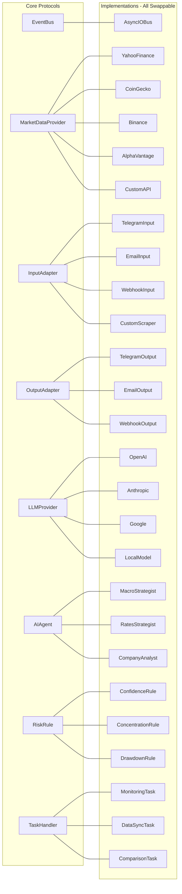
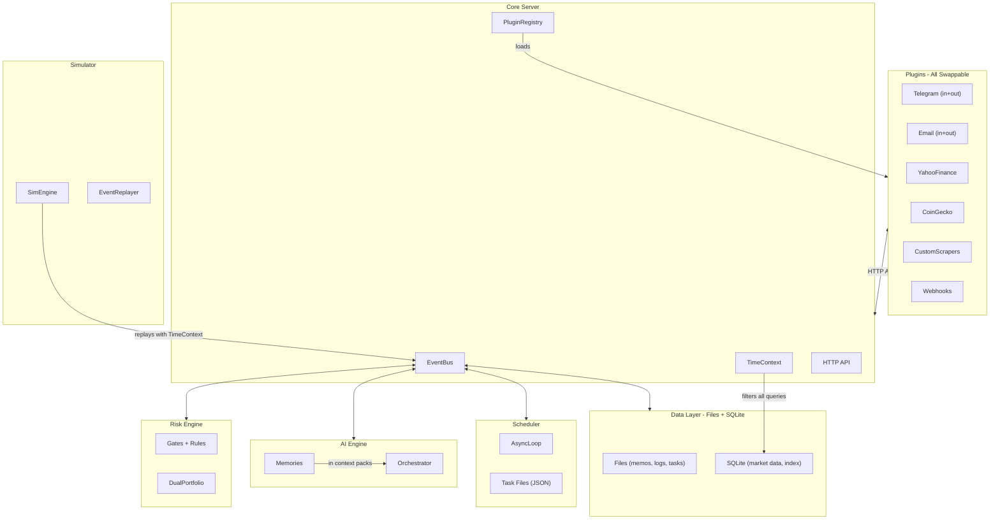

# OpenSuperFin Architecture

## Design Philosophy

OpenSuperFin is an event-driven macro/LLM trading advisory system designed to run on minimal hardware. It advises a human trader -- it does **not** execute trades automatically.

### Guiding Principles

- **Fully abstracted core**: The core defines WHAT happens (protocols). Plugins define HOW (implementations). The core never imports a concrete integration, market data source, or LLM provider.
- **File-based state**: State is files on disk -- Markdown memos you can open in any editor, JSON signals you can inspect with `jq`, JSONL audit logs you can `grep`. SQLite for indexed queries. No external database servers.
- **Minimal dependencies**: 5 core pip packages. Everything else is Python stdlib.
- **Runs on a potato**: Single async Python process, ~100MB RAM. No Docker, no PostgreSQL, no Redis, no message queues.

The AI can autonomously research, monitor, schedule tasks, and produce investment memos. The human always pulls the trigger.

The system maintains **two parallel portfolios** -- what the AI would do vs. what the human actually does -- and learns from divergences over time (see [LEARNING_LOOP.md](LEARNING_LOOP.md)).

---

## Protocols (Extension Points)

The core is defined by **8 protocols**. These are the contracts that plugins implement. The core never imports concrete implementations -- it depends only on these interfaces.



### Protocol Summary

| Protocol | Purpose | Methods |
|----------|---------|---------|
| **EventBus** | Inter-component communication | `publish(event)`, `subscribe(event_type, callback)`, `unsubscribe()` |
| **MarketDataProvider** | Fetch price/market data for any asset | `fetch(tickers, start, end) -> list[MarketData]`, `supports(ticker) -> bool` |
| **InputAdapter** | Receive data from external sources | `start()`, `stop()`, `on_message(callback)` |
| **OutputAdapter** | Deliver signals to external destinations | `send(signal) -> DeliveryResult` |
| **LLMProvider** | Call language model APIs | `complete(messages) -> str`, `tool_call(messages, tools) -> ToolResult` |
| **AIAgent** | Analyze a context pack and produce insights | `analyze(context) -> AgentOutput` |
| **RiskRule** | Evaluate a signal against a rule | `evaluate(signal, portfolio) -> RuleResult` |
| **TaskHandler** | Execute a scheduled task | `run(params) -> TaskResult` |

### The Rule

**The core imports protocols. Plugins import the core.** Never the reverse.

```
core/                          # defines protocols + models
    protocols.py               # all 8 protocols in one file
    models/                    # Pydantic data models

plugins/                       # implements protocols
    market_data/
        yahoo_finance.py       # implements MarketDataProvider
        coingecko.py           # implements MarketDataProvider
    integrations/
        telegram.py            # implements InputAdapter + OutputAdapter
    ai_providers/
        openai.py              # implements LLMProvider
    agents/
        macro.py               # implements AIAgent
    risk_rules/
        confidence.py          # implements RiskRule
```

The plugin registry discovers and loads implementations at startup based on `config.yaml`. The core never knows which concrete implementations exist.

---

## Overview

The system is composed of **7 core components** connected by an in-process event bus:



---

## Component 1: Event Bus

The central nervous system. Defined as a **protocol** so the implementation can be swapped (in-process async, Redis Streams, NATS, etc.).

### Protocol

```python
class EventBus(Protocol):
    async def publish(self, event: Event) -> None: ...
    def subscribe(self, event_type: str, callback: Callable) -> None: ...
    def unsubscribe(self, event_type: str, callback: Callable) -> None: ...
```

### Default Implementation

`AsyncIOBus`: ~100 lines of Python. A dict of `event_type -> list[callback]`. When `publish()` is called, all matching callbacks are invoked via `asyncio.create_task()`. Events are also serialized to JSON and appended to today's JSONL file for the audit log.

### Event Types

| Event | Description |
|-------|-------------|
| `integration.input` | Data arrived from a plugin (email, telegram, market data, scraper) |
| `integration.output` | Signal/notification sent via a plugin |
| `schedule.fired` | A scheduled task triggered |
| `context.assembled` | Context pack ready for AI |
| `memo.created` | AI produced an investment memo |
| `signal.proposed` | AI proposed a trade signal |
| `signal.approved` / `signal.rejected` | Risk engine verdict |
| `signal.delivered` | Signal sent to user via plugin |
| `position.confirmed` / `position.skipped` | User responded to signal |
| `position.updated` | Position state changed |
| `task.created` | AI created a new scheduled task |
| `memory.created` | Learning loop produced a new memory |

---

## Component 2: Market Data Providers

Abstracts how price and market data is fetched. The core doesn't know or care whether prices come from Yahoo Finance, CoinGecko, Binance, FRED, or a custom API.

### Protocol

```python
class MarketDataProvider(Protocol):
    name: str                                    # e.g., "yahoo_finance", "coingecko"

    async def fetch(
        self,
        tickers: list[str],
        start: datetime,
        end: datetime,
    ) -> list[MarketData]: ...

    def supports(self, ticker: str) -> bool: ... # can this provider handle this ticker?
```

### Provider Routing

Multiple providers can be active simultaneously. The system routes tickers to the right provider:

| Provider | Asset Types | Example Tickers |
|----------|-------------|-----------------|
| Yahoo Finance | Stocks, ETFs, indices, forex | AAPL, SPY, EURUSD=X |
| CoinGecko | Crypto | BTC, ETH, SOL |
| Binance | Crypto (real-time) | BTCUSDT, ETHUSDT |
| Alpha Vantage | Stocks, forex, macro | MSFT, GDP, CPI |
| FRED | Macro indicators | FEDFUNDS, T10Y2Y |
| Custom | Anything | User-defined |

The config maps tickers to providers. If a ticker isn't explicitly mapped, providers are queried via `supports()` to find the right one.

### Data Flow

Market data providers are **not** integrations (InputAdapter/OutputAdapter). They have their own protocol because their contract is more specific: they return structured `MarketData` with `available_at` timestamps, which gets stored in SQLite for TimeContext-filtered queries.

```
MarketDataProvider.fetch()
    → list[MarketData]
        → stored in SQLite (with available_at)
            → queried by AI via TimeContext
```

---

## Component 3: Integration Layer (Plugins)

Integrations handle **non-market-data** input/output: user messages, email tips, notifications, webhooks. Each integration can implement an **input** side, an **output** side, or **both**.

### Protocols

```python
class InputAdapter(Protocol):
    name: str
    async def start(self) -> None: ...
    async def stop(self) -> None: ...
    def on_message(self, callback: Callable) -> None: ...

class OutputAdapter(Protocol):
    name: str
    async def send(self, signal: Signal, memo: InvestmentMemo) -> DeliveryResult: ...
```

### Concrete Integrations

| Integration | Direction | Notes |
|-------------|-----------|-------|
| Telegram | Both | Receive user messages, send signals + memos |
| Email | Both | IMAP polling with watch rules, send detailed memos |
| Custom Scrapers | Input | User-written Python scripts that produce events |
| Webhooks | Both | Generic HTTP in/out |

### Plugin Dependencies

Each integration only adds dependencies it needs. The core doesn't import `python-telegram-bot` -- only the Telegram plugin does. If you don't use Telegram, you don't install it.

---

## Component 4: Data Layer (Files + SQLite)

All persistent state lives under `~/.opensuperfin/` (configurable).

### Files (Human-Readable)

| Path | Format | What |
|------|--------|------|
| `events/YYYY-MM-DD.jsonl` | JSONL | Append-only audit log (one file per day, greppable) |
| `memos/YYYY-MM-DD_TICKER_direction.md` | Markdown | Investment memos (open in any editor) |
| `signals/sig_UUID.json` | JSON | Signal records |
| `positions/ai/TICKER.json` | JSON | AI paper portfolio positions |
| `positions/human/TICKER.json` | JSON | Human actual portfolio positions |
| `memories/mem_UUID.json` | JSON | Learning loop memories |
| `tasks/task_UUID.json` | JSON | Scheduled task definitions |

### SQLite (Indexed Queries)

A single `db.sqlite` file for data that benefits from indexing:

- **Market data**: Time-series prices with `available_at` timestamps (for TimeContext filtering)
- **Memory index**: Tags, tickers, dates for fast memory retrieval
- **Signal index**: Quick lookups by ticker, date, status

SQLite is Python stdlib (`sqlite3`). Zero install. The file is ~50MB for years of data.

### TimeContext

All market data queries respect `TimeContext`. In production, it's "now." In simulation, it's a historical date. The data layer enforces `WHERE available_at <= ?` on all queries.

---

## Component 5: Scheduler

A simple `asyncio` loop that reads task files from `~/.opensuperfin/tasks/`. No dependencies.

### How It Works

Every 60 seconds, the scheduler:
1. Reads all `task_*.json` files from the tasks directory
2. Checks which tasks are due (cron expression matches, or `run_at` has passed)
3. Looks up the `TaskHandler` from the registry
4. Fires matching tasks
5. Updates the task file's `last_run_at` field

### Task Handler Protocol

```python
class TaskHandler(Protocol):
    name: str                                    # registered name, matches task file "handler" field
    async def run(self, params: dict) -> TaskResult: ...
```

Built-in handlers: `monitoring.check_exit`, `data_sync.market_close`, `comparison.weekly`, `analysis.daily_summary`. Custom handlers can be registered via plugins.

### Task Types

| Type | Trigger | Example |
|------|---------|---------|
| **Recurring** | Cron expression | "Monitor $NVDA daily at market close" |
| **One-off** | Specific datetime | "Pre-earnings analysis for $NVDA on March 10" |
| **Research** | Runs once immediately | "Investigate this email tip" |
| **Comparison** | Recurring | "Weekly AI-vs-human portfolio comparison" |

### AI Creates Tasks

The AI creates tasks by writing JSON files to the tasks directory. A monitoring task might create child tasks (linked via `parent_task_id`).

---

## Component 6: AI Engine

The brain. Composed of agents and an orchestrator, all built on the LLMProvider and AIAgent protocols.

### LLM Provider Protocol

```python
class LLMProvider(Protocol):
    name: str
    async def complete(self, messages: list[dict]) -> str: ...
    async def tool_call(self, messages: list[dict], tools: list[dict]) -> ToolResult: ...
```

Implementations call LLM APIs via `httpx`. No SDK dependencies required. Add any provider by implementing this protocol: OpenAI, Anthropic, Google, Mistral, local models via Ollama, etc.

### AI Agent Protocol

```python
class AIAgent(Protocol):
    name: str
    async def analyze(self, context: ContextPack) -> AgentOutput: ...
```

Each agent is a self-contained analysis unit. Add new agents by implementing this protocol. Initial agents: Macro Strategist, Rates Strategist, Company Analyst, Risk Analyst (advisory).

### Orchestrator

When triggered by events, the orchestrator:
1. Assembles a context pack (market snapshot, both portfolios, recent events, **relevant memories**)
2. Runs the relevant agent chain (macro -> rates -> company -> ...)
3. Produces a structured Investment Memo (saved as Markdown in `memos/`)
4. Publishes `signal.proposed` events
5. Can create new scheduled tasks (writes JSON files to `tasks/`)

The orchestrator depends on `LLMProvider` and `AIAgent` protocols -- it doesn't know which models or agents are active.

### Interface (Human-facing via API)

Exposed via the core HTTP API. Integrations (like Telegram) relay messages to this endpoint. Has tool-use access to query data, modify tasks, manage positions, view memories, launch simulations.

### Memories in Context

When assembling context packs, the orchestrator queries for relevant memories (by ticker, sector, catalyst type, recency) and includes them. See [LEARNING_LOOP.md](LEARNING_LOOP.md).

---

## Component 7: Risk Engine

Completely deterministic. Zero LLM involvement. Zero external dependencies. Pure Python.

### Risk Rule Protocol

```python
class RiskRule(Protocol):
    name: str
    def evaluate(self, signal: Signal, portfolio: PortfolioSummary) -> RuleEvaluation: ...
```

Add custom risk rules by implementing this protocol. Built-in rules:

| Rule | What It Checks |
|------|---------------|
| **Confidence** | Signal confidence >= minimum (e.g., 0.6) |
| **Concentration** | Sector/ticker exposure within limits |
| **Frequency** | Not exceeding max signals per day |
| **Drawdown** | Portfolio drawdown within threshold |

### How It Works

1. Subscribes to `signal.proposed` events
2. Validates against all registered rules (pure math, no AI)
3. Publishes `signal.approved` or `signal.rejected` (with reason)
4. The AI can retry with modified parameters but **cannot override**

### Dual Portfolio Tracker

Reads position files from `positions/ai/` and `positions/human/` to maintain both portfolio states. See [LEARNING_LOOP.md](LEARNING_LOOP.md).

---

## Component 8: Simulator

The same pipeline running in sandbox mode with historical data. See [SIMULATOR.md](SIMULATOR.md).

- **TimeContext** filters all data queries to the simulated date
- **Event Replayer** steps through historical events chronologically
- **Mock outputs** capture signals instead of sending them (implements `OutputAdapter` protocol)
- **Performance metrics** calculated with pure Python math
- **Model benchmarking** compares LLM providers side-by-side

---

## The Core Server

The core is a lightweight `aiohttp` HTTP server. It exposes a simple API that plugins and the AI interface use:

```
POST /events           # publish an event (used by plugins to push data)
GET  /events           # stream events (SSE) for real-time updates
POST /chat             # AI interface (send message, get response)
GET  /state/portfolio  # get portfolio state
GET  /state/tasks      # get scheduled tasks
GET  /state/memories   # get memories
POST /tasks            # create/modify tasks
GET  /health           # health check
```

This is ~200 lines of `aiohttp` code. No framework magic, no middleware stack, no OpenAPI generation. Just routes that read/write files and interact with the event bus.

---

## Plugin Registry

At startup, the system:

1. Loads `config.yaml`
2. Discovers which plugins are enabled
3. Instantiates them and registers with the appropriate protocol type
4. The core components query the registry for implementations:
   - "Give me all `MarketDataProvider`s" -> [YahooFinance, CoinGecko]
   - "Give me all `OutputAdapter`s" -> [TelegramOutput, EmailOutput]
   - "Give me the `LLMProvider` named 'anthropic'" -> AnthropicProvider
   - "Give me all `RiskRule`s" -> [ConfidenceRule, ConcentrationRule, ...]

```python
class PluginRegistry:
    def register(self, protocol_type: type, instance: Any) -> None: ...
    def get_all(self, protocol_type: type) -> list[Any]: ...
    def get(self, protocol_type: type, name: str) -> Any: ...
```

---

## State Directory Structure

```
~/.opensuperfin/                     # configurable via OPENSUPERFIN_HOME
    config.yaml                      # main configuration
    .env                             # secrets (gitignored)
    db.sqlite                        # SQLite: market data, indexes

    events/                          # audit log (JSONL, one per day)
        2026-02-13.jsonl

    memos/                           # investment memos (Markdown)
        2026-02-13_NVDA_buy.md
        2026-04-18_NVDA_sell.md

    signals/                         # signal records (JSON)
        sig_a1b2c3.json

    positions/                       # dual portfolio
        ai/
            NVDA.json
        human/
            NVDA.json

    memories/                        # learning loop (JSON)
        mem_x1y2z3.json

    tasks/                           # scheduled tasks (JSON)
        task_monitor_nvda.json
        task_weekly_comparison.json

    market/                          # cached raw market data (JSON, optional)
        NVDA.json
        SPY.json

    simulations/                     # simulation results
        claude_2024/
            results.json
            signals/
```

---

## Dependency Footprint

### Core (5 packages)

| Package | Purpose | Size |
|---------|---------|------|
| `pydantic` | Data validation, settings | ~2MB |
| `pyyaml` | Config file parsing | ~0.5MB |
| `python-dotenv` | .env loading | ~0.1MB |
| `aiohttp` | Lightweight async HTTP server | ~1.5MB |
| `httpx` | HTTP client (LLM APIs, data fetching) | ~1MB |

### Python Stdlib (free)

`sqlite3`, `json`, `asyncio`, `pathlib`, `datetime`, `math`, `statistics`, `logging`, `imaplib`, `smtplib`, `hashlib`, `uuid`

### Plugin Dependencies (optional, per-plugin)

| Plugin | Extra Dependency |
|--------|-----------------|
| Telegram | `python-telegram-bot` |
| Email | None (stdlib `imaplib`/`smtplib`) |
| Yahoo Finance | `yfinance` or just `httpx` (already installed) |
| CoinGecko | None (`httpx` already installed) |
| Custom Scrapers | Whatever the scraper needs |

---

## How Components Connect

```
Plugins (implement protocols)
    ↕ HTTP
Core Server (aiohttp, ~200 LOC)
    ↕ in-process
EventBus (protocol) → AuditLog (JSONL)
    ↕ callbacks
┌───────────┬────────────┬──────────┬───────────┐
│ Scheduler │ AI Engine  │ Risk     │ Simulator │
│ (reads    │ (LLMProv + │ Engine   │ (replays  │
│  task     │  AIAgent   │ (RiskRule│  events)  │
│  files)   │  protocols)│  protocol│           │
└───────────┴────────────┴──────────┴───────────┘
        ↕
Files + SQLite (~/.opensuperfin/)
```

No component directly imports another. They communicate through the event bus (protocol) and read/write shared state. Every external interaction goes through a protocol. Every protocol has a default implementation that can be swapped.
