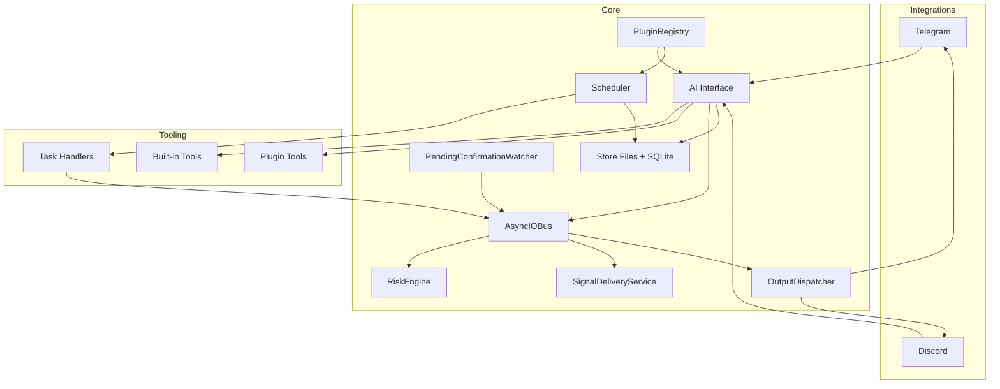

# ClawQuant Architecture

## Runtime Status First

This file separates:
- **Current runtime architecture** (what is wired in `main.py` today)
- **Target-state architecture** (modules that exist or are planned, but are not the default live path)

Current runtime is **chat-first**:
`integration message -> AI tool loop -> integration.output -> output dispatcher`.

Signal lifecycle is also live for AI-proposed positions:
`open_potential_position -> signal.proposed -> risk gate -> signal.approved/rejected -> signal.delivered`.

---

## Core Design Principles

- Protocol-based core (`core/protocols.py`) with plugin implementations.
- Event bus for decoupled communication (`core/bus.py`).
- File-first persistent state with SQLite indexes (`core/data/store.py`).
- AI interface is the main user interaction layer (`engine/interface.py`).
- Integrations are transport adapters, not business-logic owners.

---

## Protocol Surface (8)

| Protocol | Purpose |
|----------|---------|
| `EventBus` | Pub/sub between components |
| `MarketDataProvider` | Price/market retrieval |
| `InputAdapter` | External inbound messages |
| `OutputAdapter` | External outbound delivery |
| `LLMProvider` | LLM completions + tool calls |
| `AIAgent` | Analysis agents (orchestrator path) |
| `RiskRule` | Deterministic signal gating rules |
| `TaskHandler` | Scheduled task execution |

---

## Current Runtime Architecture

### What `main.py` initializes today

- `Store`
- `AsyncIOBus`
- `PluginRegistry`
- `Scheduler`
- `PortfolioTracker`
- `AIInterface`
- `RiskEngine` subscriber (`signal.proposed`)
- `SignalDeliveryService` subscriber (`signal.approved`)
- `PendingConfirmationWatcher` loop (overdue pending reminders)
- `OutputDispatcher` subscribed to `integration.output`
- `aiohttp` server (`server.py`)

### What plugins are loaded by runtime now

- Integrations: `telegram`, `discord`
- Market data providers: `yahoo_finance`
- LLM providers: `openai`, `anthropic`, `openrouter` (if API keys exist)
- Task handlers:
  - `ai.run_prompt`
  - `comparison.weekly`
  - `news.briefing`
  - `notifications.send`
  - `web.search`
  - `browser.selenium` (optional, loaded only when `selenium_browser` is enabled)

Risk rules are loaded and actively evaluated in runtime through `RiskEngine`.

---

## AI Interface (Current)

`engine/interface.py` is the live conversation controller for Telegram and Discord.

### Built-in tools

- `open_potential_position`
- `confirm_signal`
- `skip_signal`
- `close_position`
- `user_initiated_trade`
- `get_portfolio`
- `get_price`
- `list_tasks`
- `list_task_handlers`
- `create_task`
- `delete_task`
- `delete_task_by_name`
- `get_memories`
- `get_signals`
- `run_analysis`

### Plugin tool extension

Plugins can add tool schemas and execution handlers dynamically via:
- `get_tools()`
- `call_tool(...)`

Plugins can also inject runtime prompt guidance via optional hooks:
- `get_system_prompt_instructions()`
- `get_scheduled_prompt_instructions()`
- `get_prompt_instructions(context=...)`

Current plugin tools include:
- `get_news` (news plugin)
- `web_search` (web search plugin)
- `open_browser` / `close_browser` / `list_saved_logins` / `run_selenium_code` / `get_browser_screenshot` / `get_page_code` (optional selenium browser plugin)

For selenium login flows, `run_selenium_code` provides helper `get_saved_login("<profile_id>")`.
`get_browser_screenshot` returns a base64 image payload in tool output (data URL form when complete; preview + truncated flag when cut by `max_base64_chars`).
When a complete `base64_data_url` is present, the AI interface feeds it back into the next model turn as an image content part.

### Tool-loop behavior

- Multi-round tool calls in one assistant turn.
- Max rounds: `25`.
- If limit is reached, the loop injects an internal max-rounds message and asks for confirmation in a new user turn.

### Conversation persistence + onboarding

- Conversation messages persist in SQLite table `conversation_messages`.
- First message in a channel stores one merged user entry:
  - onboarding directive
  - initial user message block
- Subsequent turns store user text normally.

---

## Scheduler and Task Execution (Current)

- Scheduler reads task JSON files from `~/.clawquant/tasks`.
- Due tasks are executed by handler name (`Task.handler`).
- Task history fields (`last_run_at`, `last_result`, `run_count`) are updated per run.

### `ai.run_prompt` behavior

`plugins/task_handlers/ai_runner.py` invokes the same central AI interface used by chat.

Scheduled run context order:
1. system prompt
2. last 10 messages from same channel
3. task prompt (`params.prompt`)

Result is published as `integration.output` and delivered through the same output dispatcher path as chat.
If the scheduled AI responds with exactly `[NO_REPLY]`, delivery is skipped for that run.

---

## Output Delivery Pipeline (Current)

All outbound user-visible messages are published as `integration.output` events.

`core/output_dispatcher.py` routes delivery by:
- optional `adapter` constraint
- optional `channel_id`
- adapter capability (`send_text`)

This keeps integrations modular and transport-focused.

For approved trade signals, `SignalDeliveryService` uses output adapters' `send(signal, memo=None)` path and then emits `signal.delivered` when at least one adapter succeeds.

---

## HTTP Server (Current Routes)

`server.py` currently exposes:

- `GET /health`
- `POST /events`
- `GET /events` (SSE)
- `GET /state/portfolio`
- `GET /state/portfolio/{portfolio_type}`
- `GET /state/tasks`
- `POST /tasks`
- `DELETE /tasks/{task_id}`
- `GET /state/signals`
- `GET /state/memories`
- `GET /state/plugins`

`POST /chat` is not currently implemented.

---

## Storage Architecture

### File-backed state

- `events/YYYY-MM-DD.jsonl`
- `signals/*.json`
- `positions/ai/*.json`
- `positions/human/*.json`
- `memories/*.json`
- `tasks/*.json`
- `memos/*.md`

### SQLite tables

- `market_data`
- `memory_index`
- `conversation_messages`

---

## Target-State / Coming Soon

The following modules and flows exist conceptually (and partly in code) but are **not the default live runtime path** today:

- `engine/orchestrator.py` as always-on subscriber for live input events
- Fully autonomous ambient orchestrator triggering (without explicit tool invocation)
- Auto-creation of recurring tasks from config (`scheduler.default_tasks`, `learning.comparison_schedule`)
- Simulator exposure through CLI/server with validated workflow coverage
- Additional integrations/providers shown in legacy examples (email/webhook/custom scraper/CoinGecko)
