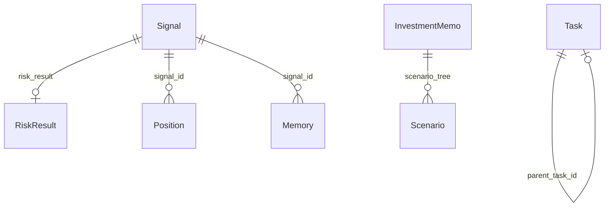

# Data Models

Data contracts are defined in `core/models/` (Pydantic v2), with one notable exception: persisted chat history rows are stored directly in SQLite (`conversation_messages`).

This doc distinguishes:
- **current storage/runtime usage**
- **target-state fields/events that exist in models but are not fully exercised by default runtime wiring**

---

## Storage Map (Current)

| Data | Storage | Format | Path / Table |
|------|---------|--------|--------------|
| Event log | File | JSONL | `events/YYYY-MM-DD.jsonl` |
| Signal | File | JSON | `signals/sig_*.json` |
| Position | File | JSON | `positions/ai/*.json`, `positions/human/*.json` |
| Investment memo | File | Markdown | `memos/*.md` |
| Memory | File + SQLite index | JSON + rows | `memories/mem_*.json`, table `memory_index` |
| Task | File | JSON | `tasks/task_*.json` |
| Market data | SQLite | rows | table `market_data` |
| Conversation messages | SQLite | rows | table `conversation_messages` |
| Simulation run result | File | JSON | `simulations/<run_id>/results.json` |

---

## Event

Defined in `core/models/events.py`.

```python
class Event(BaseModel):
    id: str
    type: str
    timestamp: datetime
    correlation_id: str
    source: str
    payload: dict
    metadata: dict | None
```

### Event types: defined vs commonly emitted today

| Event type | Defined constant | Default runtime emission |
|------------|------------------|--------------------------|
| `integration.input` | Yes | Yes (currently mostly from `run_analysis` tool) |
| `integration.output` | Yes | Yes |
| `schedule.fired` | Yes | Yes |
| `task.created` | Yes | Yes |
| `position.confirmed` | Yes | Yes |
| `position.skipped` | Yes | Yes |
| `position.updated` | Yes | Yes |
| `memory.created` | Yes | Yes (when comparison creates memory) |
| `context.assembled` | Yes | Target-state path |
| `memo.created` | Yes | Target-state path |
| `signal.proposed` | Yes | Target-state path |
| `signal.approved` | Yes | Target-state path |
| `signal.rejected` | Yes | Target-state path |
| `signal.delivered` | Yes | Target-state path |
| `alert.triggered` | Yes | Target-state path |
| `simulation.started/completed` | Yes | Not emitted by current simulation module |

---

## Task

Defined in `core/models/tasks.py`.

```python
class Task(BaseModel):
    id: str
    name: str
    type: Literal["one_off", "recurring", "research", "comparison"]
    cron_expression: str | None
    run_at: datetime | None
    handler: str
    params: dict
    enabled: bool
    created_by: Literal["human", "ai"]
    created_at: datetime
    parent_task_id: str | None
    last_run_at: datetime | None
    last_result: str | None
    run_count: int
```

### Handler names currently loaded by runtime

- `ai.run_prompt`
- `comparison.weekly`
- `news.briefing`
- `notifications.send`
- `web.search`

---

## Signal

Defined in `core/models/signals.py`.

```python
class Signal(BaseModel):
    id: str
    ticker: str
    direction: Literal["buy", "sell", "hold"]
    catalyst: str
    confidence: float
    entry_target: float | None
    stop_loss: float | None
    take_profit: float | None
    horizon: str
    memo_id: str
    created_at: datetime
    correlation_id: str
    status: Literal["proposed", "approved", "rejected", "delivered"]
    risk_result: RiskResult | None
    delivered_at: datetime | None
    delivered_via: str | None
```

Status fields are valid and persisted; however, in default live runtime the full orchestrator/risk delivery lifecycle is not the primary wired path.

---

## Position

Defined in `core/models/signals.py`.

```python
class Position(BaseModel):
    ticker: str
    direction: Literal["long", "short"]
    size: float | None
    entry_price: float
    current_price: float | None
    pnl: float | None
    pnl_percent: float | None
    status: Literal[
        "signaled", "confirmed", "assumed", "skipped",
        "monitoring", "exit_signaled", "closed"
    ]
    portfolio: Literal["ai", "human"]
    signal_id: str | None
    opened_at: datetime
    closed_at: datetime | None
    close_price: float | None
    realized_pnl: float | None
    realized_pnl_percent: float | None
    confirmed_at: datetime | None
    confirmed_via: str | None
    user_notes: str | None
```

Some lifecycle statuses are target-state for default runtime automation (`assumed`, `exit_signaled`). The model supports them even when no automatic transition currently sets them.

---

## InvestmentMemo and Scenario

Defined in `core/models/memos.py`.

```python
class Scenario(BaseModel):
    name: str
    probability: float
    description: str
    target_price: float | None
    timeline: str | None

class InvestmentMemo(BaseModel):
    id: str
    created_at: datetime
    correlation_id: str
    executive_summary: str
    catalyst: str
    market_context: str
    pricing_vs_view: str
    scenario_tree: list[Scenario]
    trade_expression: str
    entry_plan: str
    risks: list[str]
    monitoring_plan: str
    agents_used: list[str]
    model_provider: str
    model_name: str
```

Memo model and markdown rendering are implemented; always-on live orchestrator memo generation is target-state in default runtime wiring.

---

## Memory

Defined in `core/models/memories.py`.

```python
class Memory(BaseModel):
    id: str
    created_at: datetime
    signal_id: str | None
    divergence_type: Literal[
        "human_skipped", "human_modified", "human_initiated", "timing_divergence"
    ]
    ai_action: str
    human_action: str
    outcome_period: str
    outcome: str
    ai_pnl: float | None
    human_pnl: float | None
    who_was_right: Literal["ai", "human", "both", "neither"]
    lesson: str
    tags: list[str]
    confidence_impact: float
    referenced_in_decisions: int
    source: Literal["production", "simulation"]
```

SQLite index schema in `Store._init_sqlite()`:

```sql
CREATE TABLE memory_index (
    id TEXT PRIMARY KEY,
    created_at TEXT NOT NULL,
    who_was_right TEXT,
    tags TEXT DEFAULT '',
    ticker TEXT DEFAULT '',
    confidence_impact REAL DEFAULT 0.0,
    source TEXT DEFAULT 'production'
);
```

---

## MarketData

Defined in `core/models/market.py`.

```python
class MarketData(BaseModel):
    ticker: str
    timestamp: datetime
    available_at: datetime
    open: float | None
    high: float | None
    low: float | None
    close: float
    volume: float | None
    source: str
    data_type: str
    metadata: dict | None
```

SQLite schema (`market_data`) includes `(ticker, timestamp, source)` primary key and index on `(ticker, available_at)` for time-filtered retrieval.

---

## Context Models (In-Memory)

Defined in `core/models/context.py` and `core/time_context.py`.

- `TimeContext`
- `ContextPack`
- `PortfolioSummary`
- `MarketSnapshot`
- `MarketRegime`

These are central to orchestrator/simulation paths; the default chat runtime primarily uses portfolio/task/tool flows rather than full context-pack orchestration.

---

## Conversation History Row Model (SQLite)

Conversation persistence is implemented in `core/data/store.py` directly (not as a Pydantic model):

```sql
CREATE TABLE conversation_messages (
    id INTEGER PRIMARY KEY AUTOINCREMENT,
    channel_id TEXT NOT NULL,
    role TEXT NOT NULL,
    content TEXT NOT NULL,
    message_json TEXT,
    created_at TEXT NOT NULL
);
```

`message_json` stores the full chat message payload (spec-shaped dict), enabling
round-trip persistence of richer message forms (e.g., multimodal content, `tool_calls`,
`tool_call_id`) while `content` remains as backward-compatible text.

Used by `AIInterface` for:
- long-term chat continuity
- first-turn onboarding directive persistence
- scheduled `ai.run_prompt` context injection (last 10 messages)
- spec-shaped intermediate tool interactions in normal chat turns:
  - `role: "assistant"` with `tool_calls`
  - `role: "tool"` with `tool_call_id` + `content`

---

## Simulation Models

Defined in `core/models/simulations.py`.

- `SimulationConfig`
- `PerformanceMetrics`
- `SimulationRun`

These models are implemented and used by `simulator/engine.py`, but simulator execution is not yet exposed as a first-class CLI/server command in current runtime docs.

---

## Relationship View


