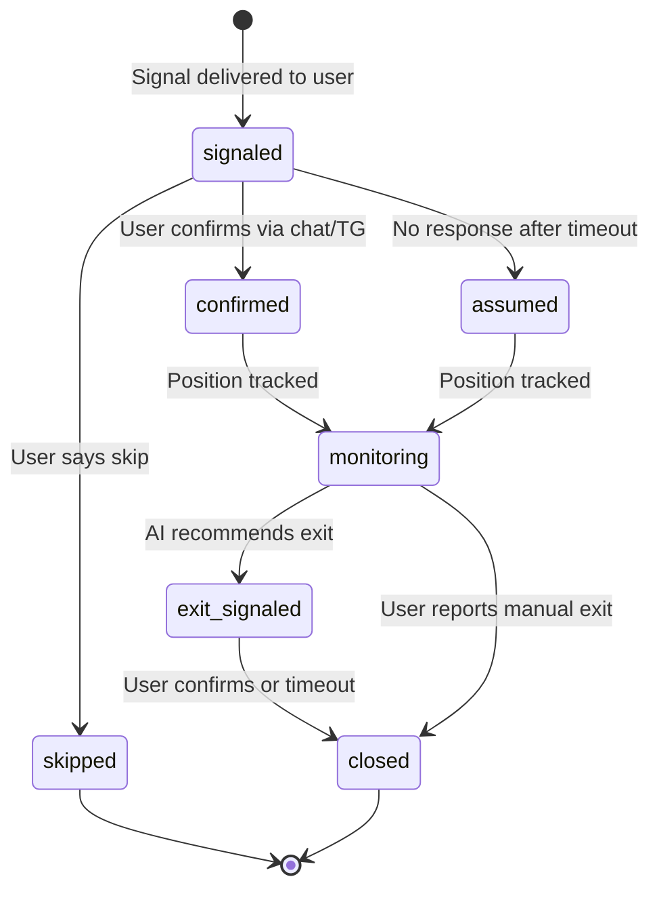
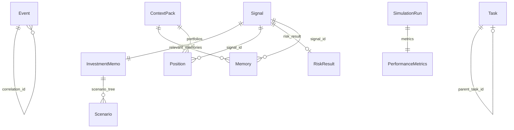

# Data Models

All data models are defined as Pydantic v2 models in `core/models/`. These are the contracts between components. Every event, every file on disk, every API response is a typed Pydantic model that serializes to/from JSON (or Markdown for memos).

---

## Storage Model

Each model type maps to a storage location:

| Model | Storage | Format | Path |
|-------|---------|--------|------|
| Event | File | JSONL (append) | `events/YYYY-MM-DD.jsonl` |
| Signal | File | JSON | `signals/sig_{id}.json` |
| Position | File | JSON | `positions/{ai,human}/{ticker}.json` |
| InvestmentMemo | File | Markdown | `memos/YYYY-MM-DD_{ticker}_{direction}.md` |
| Memory | File + SQLite index | JSON | `memories/mem_{id}.json` |
| Task | File | JSON | `tasks/task_{id}.json` |
| MarketData | SQLite | Rows | `db.sqlite` table `market_data` |
| SimulationRun | File | JSON | `simulations/{name}/results.json` |

---

## Event

The universal message format. Every inter-component communication is an Event. Persisted as one JSON line per event in daily JSONL files.

```python
class Event:
    id: str                     # UUID
    type: str                   # e.g., "signal.proposed", "integration.input"
    timestamp: datetime         # when the event was created (UTC)
    correlation_id: str         # groups related events into a decision chain
    source: str                 # which component produced this event
    payload: dict               # event-type-specific data
```

### Correlation Chains

Events are linked by `correlation_id`. Example chain:

```
correlation_id: "abc-123"
  1. integration.input     → email from trusted investor
  2. context.assembled     → market data + portfolio + memories gathered
  3. memo.created          → investment memo produced
  4. signal.proposed       → BUY NVDA signal
  5. signal.approved       → risk engine passed
  6. signal.delivered      → Telegram notification sent
  7. position.confirmed    → user replied "bought at 130"
  8. task.created          → daily monitoring task spawned
```

### On Disk

```jsonl
{"id":"evt_a1","type":"integration.input","timestamp":"2026-02-13T14:30:00Z","correlation_id":"abc-123","source":"email","payload":{"from":"investor@email.com","subject":"Look at NVDA"}}
{"id":"evt_a2","type":"signal.proposed","timestamp":"2026-02-13T14:31:15Z","correlation_id":"abc-123","source":"orchestrator","payload":{"ticker":"NVDA","direction":"buy","confidence":0.78}}
```

---

## TimeContext

Controls what data the system can see. The key to zero lookahead bias.

```python
class TimeContext:
    current_time: datetime      # "now" in production, simulated date in backtest
    mode: Literal["production", "simulation"]
    simulation_id: str | None   # links to SimulationRun if in simulation mode
```

Every market data query passes through TimeContext. The data layer enforces `WHERE available_at <= ?`.

---

## Signal

A trade recommendation produced by the AI and gated by the Risk Engine. Stored as a JSON file.

```python
class Signal:
    id: str                     # UUID
    ticker: str                 # e.g., "NVDA"
    direction: Literal["buy", "sell", "hold"]
    catalyst: str               # what triggered this signal
    confidence: float           # 0.0 to 1.0
    entry_target: float | None  # suggested entry price (None = market)
    stop_loss: float | None
    take_profit: float | None
    horizon: str                # e.g., "1-2 weeks", "3 months"
    memo_id: str                # links to the InvestmentMemo file
    created_at: datetime
    correlation_id: str

    # Risk engine fields (populated after gate)
    status: Literal["proposed", "approved", "rejected", "delivered"]
    risk_result: RiskResult | None
    delivered_at: datetime | None
    delivered_via: str | None   # e.g., "telegram", "email"
```

### On Disk

```json
// signals/sig_a1b2c3.json
{
  "id": "sig_a1b2c3",
  "ticker": "NVDA",
  "direction": "buy",
  "catalyst": "Trusted source tip + datacenter demand",
  "confidence": 0.78,
  "entry_target": 130.0,
  "stop_loss": 118.0,
  "take_profit": 152.0,
  "horizon": "2-3 months",
  "memo_id": "2026-02-13_NVDA_buy",
  "status": "approved",
  "created_at": "2026-02-13T14:31:15Z",
  "correlation_id": "abc-123"
}
```

---

## Position

A tracked position in either the AI or human portfolio. One JSON file per ticker per portfolio.

```python
class Position:
    ticker: str
    direction: Literal["long", "short"]
    size: float | None          # number of units/shares/coins (None if unknown)
    entry_price: float
    current_price: float | None
    pnl: float | None
    pnl_percent: float | None

    # Lifecycle
    status: Literal[
        "signaled",             # signal sent, awaiting user response
        "confirmed",            # user confirmed the trade
        "assumed",              # no response after timeout
        "skipped",              # user explicitly skipped
        "monitoring",           # actively monitored
        "exit_signaled",        # AI recommended closing
        "closed",
    ]

    # Tracking
    portfolio: Literal["ai", "human"]
    signal_id: str | None       # links to originating Signal (None for human-initiated)
    opened_at: datetime
    closed_at: datetime | None
    close_price: float | None
    realized_pnl: float | None
    realized_pnl_percent: float | None

    # Human portfolio only
    confirmed_at: datetime | None
    confirmed_via: str | None   # "telegram", "chat", "broker_sync"
    user_notes: str | None      # reason for skipping/modifying
```

### On Disk

```json
// positions/human/NVDA.json
{
  "ticker": "NVDA",
  "direction": "long",
  "size": 100,
  "entry_price": 130.0,
  "current_price": 142.30,
  "pnl": 1230.0,
  "pnl_percent": 9.46,
  "status": "monitoring",
  "portfolio": "human",
  "signal_id": "sig_a1b2c3",
  "opened_at": "2026-02-13T15:00:00Z",
  "confirmed_at": "2026-02-13T15:05:00Z",
  "confirmed_via": "telegram"
}
```

### Position Lifecycle



---

## InvestmentMemo

A structured analysis document produced by the AI orchestrator. Stored as **Markdown** -- human-readable, openable in any editor.

```python
class InvestmentMemo:
    id: str                     # e.g., "2026-02-13_NVDA_buy"
    created_at: datetime
    correlation_id: str

    # Content sections
    executive_summary: str
    catalyst: str
    market_context: str
    pricing_vs_view: str
    scenario_tree: list[Scenario]
    trade_expression: str
    entry_plan: str
    risks: list[str]
    monitoring_plan: str

    # Metadata
    agents_used: list[str]
    model_provider: str
    model_name: str

class Scenario:
    name: str                   # "Bull", "Base", "Bear"
    probability: float
    description: str
    target_price: float | None
```

### On Disk

```markdown
<!-- memos/2026-02-13_NVDA_buy.md -->
---
id: 2026-02-13_NVDA_buy
created_at: 2026-02-13T14:31:00Z
correlation_id: abc-123
agents_used: [macro, company]
model_provider: anthropic
model_name: claude-sonnet-4  # whatever model was used
---

# BUY NVDA — Datacenter Demand Acceleration

## Executive Summary
NVDA presents a compelling entry at $130 driven by...

## Catalyst
Trusted source tip combined with datacenter demand acceleration...

## Market Context
Semiconductor sector momentum positive for 6 weeks...

## Scenarios

| Scenario | Probability | Target | Timeline |
|----------|-------------|--------|----------|
| Bull     | 60%         | $155   | 2-3 months |
| Base     | 25%         | $140   | 2-3 months |
| Bear     | 15%         | $115   | 1 month    |

## Trade Expression
Long NVDA. Entry at $130, stop at $118, target $152.

## Risks
- Earnings miss in upcoming quarter
- Semiconductor export controls tightening
- Broader market correction

## Monitoring Plan
Daily price + volume check. Pre-earnings deep dive. Watch for...
```

---

## ContextPack

The structured input assembled for the AI orchestrator before analysis. This is an in-memory object, not persisted to disk.

```python
class ContextPack:
    time_context: TimeContext
    market_snapshot: MarketSnapshot
    ai_portfolio: PortfolioSummary
    human_portfolio: PortfolioSummary
    trigger_event: Event
    recent_events: list[Event]
    relevant_memories: list[Memory]
    watchlist: list[str]

class MarketSnapshot:
    timestamp: datetime
    prices: dict[str, float]    # {"SPY": 512.30, "NVDA": 128.50, ...}
    vix: float | None
    yields: dict[str, float]    # {"2Y": 4.52, "10Y": 4.15}

class PortfolioSummary:
    portfolio_type: Literal["ai", "human"]
    total_value: float
    cash: float
    positions: list[Position]
    total_pnl: float
    total_pnl_percent: float
```

---

## Memory

A structured learning from AI-vs-human divergences. Stored as JSON file + indexed in SQLite for fast retrieval. See [LEARNING_LOOP.md](LEARNING_LOOP.md).

```python
class Memory:
    id: str
    created_at: datetime
    signal_id: str | None

    # The divergence
    divergence_type: Literal[
        "human_skipped",
        "human_modified",
        "human_initiated",
        "timing_divergence",
    ]
    ai_action: str              # "BUY NVDA at 130"
    human_action: str           # "skipped"

    # The outcome
    outcome_period: str         # "2 weeks"
    outcome: str                # "NVDA rose to 149.50 (+15%)"
    ai_pnl: float | None
    human_pnl: float | None
    who_was_right: Literal["ai", "human", "both", "neither"]

    # The lesson
    lesson: str                 # AI-generated insight
    tags: list[str]             # ["earnings", "momentum", "semiconductor"]
    confidence_impact: float    # suggested adjustment for similar signals

    # Usage tracking
    referenced_in_decisions: int
```

### On Disk

```json
// memories/mem_x1y2z3.json
{
  "id": "mem_x1y2z3",
  "created_at": "2026-03-01T09:00:00Z",
  "signal_id": "sig_a1b2c3",
  "divergence_type": "human_skipped",
  "ai_action": "BUY AAPL at 180",
  "human_action": "Skipped -- thinks earnings will disappoint",
  "outcome_period": "3 weeks",
  "outcome": "AAPL dropped to 165 (-8.3%)",
  "ai_pnl": -15.0,
  "human_pnl": 0.0,
  "who_was_right": "human",
  "lesson": "Human showed accurate intuition about AAPL pre-earnings risk...",
  "tags": ["earnings", "pre_earnings_caution", "AAPL", "tech"],
  "confidence_impact": -0.1,
  "referenced_in_decisions": 0
}
```

### SQLite Index

For fast retrieval, memories are also indexed in SQLite:

```sql
CREATE TABLE memory_index (
    id TEXT PRIMARY KEY,
    created_at TEXT,
    who_was_right TEXT,
    tags TEXT,           -- comma-separated for LIKE queries
    ticker TEXT,         -- extracted from tags for direct lookup
    confidence_impact REAL
);
```

---

## Task

A scheduled task. The scheduler reads these files from the `tasks/` directory.

```python
class Task:
    id: str
    name: str
    type: Literal["one_off", "recurring", "research", "comparison"]

    # Schedule
    cron_expression: str | None # for recurring (e.g., "0 16 * * 1-5")
    run_at: datetime | None     # for one-off tasks

    # Execution
    handler: str                # e.g., "monitoring.check_exit"
    params: dict                # e.g., {"ticker": "NVDA"}

    # Metadata
    enabled: bool
    created_by: Literal["human", "ai"]
    created_at: datetime
    parent_task_id: str | None

    # Execution history
    last_run_at: datetime | None
    last_result: str | None
    run_count: int
```

### On Disk

```json
// tasks/task_monitor_nvda.json
{
  "id": "task_monitor_nvda",
  "name": "Monitor NVDA daily for exit signals",
  "type": "recurring",
  "cron_expression": "0 16 * * 1-5",
  "handler": "monitoring.check_exit",
  "params": {"ticker": "NVDA", "signal_id": "sig_a1b2c3"},
  "enabled": true,
  "created_by": "ai",
  "created_at": "2026-02-13T14:35:00Z",
  "parent_task_id": null,
  "last_run_at": "2026-04-10T16:00:00Z",
  "last_result": "no_action",
  "run_count": 38
}
```

---

## MarketData

Time-series market data stored in SQLite for indexed querying.

```python
class MarketData:
    ticker: str
    timestamp: datetime         # market event time
    available_at: datetime      # when this data became available
    open: float | None
    high: float | None
    low: float | None
    close: float
    volume: float | None
    source: str                 # "yahoo_finance", "fred", etc.
    data_type: str              # "price", "macro_indicator", "yield"
```

### SQLite Schema

```sql
CREATE TABLE market_data (
    ticker TEXT NOT NULL,
    timestamp TEXT NOT NULL,
    available_at TEXT NOT NULL,
    open REAL,
    high REAL,
    low REAL,
    close REAL NOT NULL,
    volume REAL,
    source TEXT,
    data_type TEXT DEFAULT 'price',
    PRIMARY KEY (ticker, timestamp, source)
);

CREATE INDEX idx_market_available_at ON market_data(ticker, available_at);
```

The `available_at` index is critical for TimeContext filtering in simulations.

---

## SimulationRun

A record of a backtest run. See [SIMULATOR.md](SIMULATOR.md).

```python
class SimulationRun:
    id: str
    name: str
    config: SimulationConfig
    status: Literal["pending", "running", "completed", "failed"]
    started_at: datetime | None
    completed_at: datetime | None
    signal_count: int
    metrics: PerformanceMetrics | None

class SimulationConfig:
    date_range: tuple[str, str]
    initial_capital: float
    ai_provider: str
    ai_model: str
    agents: list[str]
    slippage_bps: float
    commission_per_trade: float

class PerformanceMetrics:
    total_return: float
    cagr: float
    sharpe_ratio: float
    max_drawdown: float
    max_drawdown_duration_days: int
    volatility: float
    hit_rate: float
    win_loss_ratio: float
    profit_factor: float
    total_signals: int
    vs_spy: float
    vs_qqq: float
```

---

## RiskResult

The outcome of risk rule evaluation.

```python
class RiskResult:
    approved: bool
    evaluations: list[RuleEvaluation]

class RuleEvaluation:
    rule_name: str
    passed: bool
    reason: str
    current_value: float | None
    limit_value: float | None
```

---

## Model Relationships


