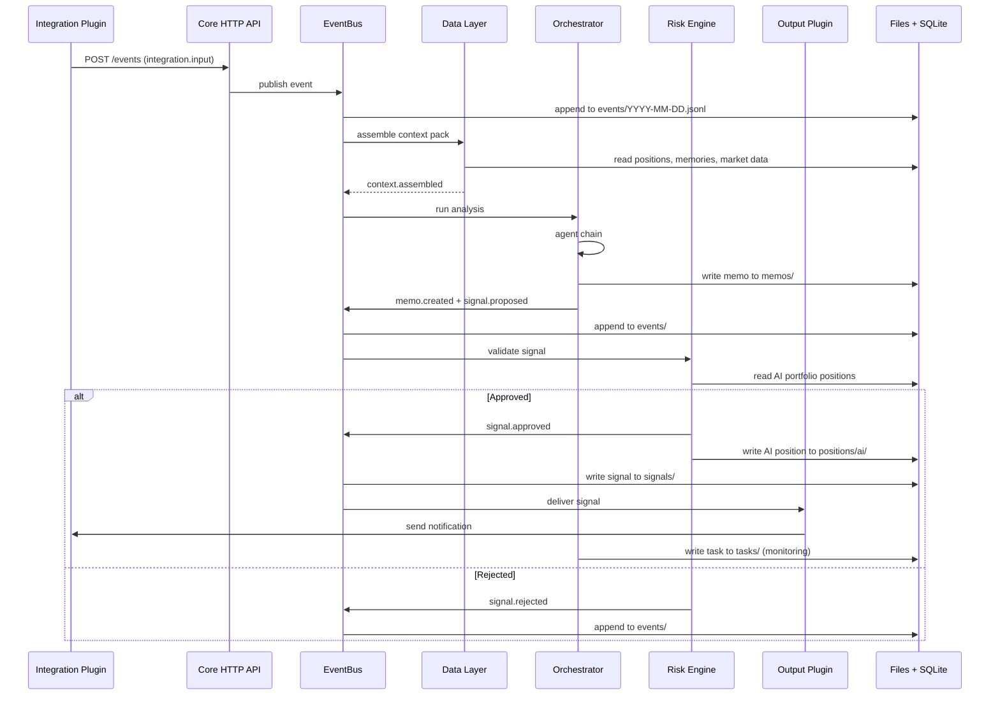

# Event Flows

Core event flows through the system. Every flow is a chain of events connected by a `correlation_id`, persisted as JSONL in `~/.opensuperfin/events/`.

---

## The Golden Path: Trigger to Signal Delivery



---

## Full Example: Email Tip to Sell (2+ months)

### Day 0: Email arrives

```
1. integration.input
   source: email, from: investor@email.com, subject: "Look at NVDA"
   priority: high (matched watch rule)

2. context.assembled
   NVDA: $128.50 | SPY: $510.20 | VIX: 14.2
   AI portfolio: [...] | Human portfolio: [...]
   Memories: ["Last tip from this investor returned +8%"]

3. memo.created
   → Written to memos/2026-02-13_NVDA_buy.md
   Thesis: datacenter demand + trusted source

4. signal.proposed
   NVDA | BUY | confidence: 0.78 | entry: $130 | stop: $118 | target: $152

5. signal.approved
   → AI portfolio: NVDA position opened at $130 (positions/ai/NVDA.json)
   → Signal written to signals/sig_a1b2c3.json

6. signal.delivered via Telegram
   "BUY NVDA at $130 | Confidence: 78% | Stop: $118 | Target: $152"

7. task.created
   → Written to tasks/task_monitor_nvda.json
   "Monitor NVDA daily at market close"
```

### Day 0: User responds

```
8. integration.input via Telegram
   "bought at 130"

9. position.confirmed
   → Human portfolio: NVDA opened at $130 (positions/human/NVDA.json)
   → Both portfolios aligned
```

### Day 60: Daily monitor detects earnings

```
10. schedule.fired: "Monitor NVDA daily"

11. AI queries data, finds earnings in 7 days

12. task.created: "Pre-earnings analysis" (tasks/task_nvda_pre_earnings.json)
    run_at: 2026-04-17 09:00, parent: task_monitor_nvda

13. task.created: "Post-earnings analysis" (tasks/task_nvda_post_earnings.json)
    run_at: 2026-04-18 18:00, parent: task_monitor_nvda

14. signal.delivered (hold notification)
    "NVDA Update: $142.30 (+9.5%) | Earnings in 7 days | HOLD"
```

### Day 66: Pre-earnings

```
15. schedule.fired: "Pre-earnings analysis NVDA"

16. context.assembled
    NVDA: $145.10 (+11.6%) | Consensus EPS: $0.82
    Memories: ["Human cautious around earnings -- skipped last 2"]

17. signal.delivered (analysis, not a trade signal)
    "NVDA Pre-Earnings: Consensus looks beatable. Recommendation: HOLD"
```

### Day 67: Post-earnings, SELL

```
18. schedule.fired: "Post-earnings analysis NVDA"

19. NVDA after-hours: $131.20 | EPS: $0.79 (miss) | Guidance: below

20. memo.created → memos/2026-04-18_NVDA_sell.md

21. signal.proposed: SELL NVDA | confidence: 0.85

22. signal.approved
    → AI portfolio: NVDA closed at $131.20 | P&L: +0.9%

23. signal.delivered via Telegram
    "SELL NVDA | Current: $131.20 | AI P&L: +0.9%"

24. integration.input: "sold at 125"

25. position.confirmed (close)
    → Human portfolio: NVDA closed at $125.00 | P&L: -3.8%
    → DIVERGENCE: AI got +0.9%, human got -3.8%
```

### Day 74: Learning

```
26. schedule.fired: "Weekly portfolio comparison"

27. Divergence found: timing_divergence on NVDA sell
    AI: sold at 131.20 | Human: sold at 125.00

28. memory.created → memories/mem_timing_nvda.json
    Lesson: "After-hours earnings misses gap down further at open.
             Act quickly on post-earnings SELL signals."
    Tags: [earnings, timing, NVDA]
```

---

## Flow: Human Skips a Signal

```
1. signal.delivered: "BUY AAPL at $180"

2. integration.input: "nah, earnings will disappoint. skipping"

3. position.skipped
   → AI portfolio: AAPL opened at $180 (positions/ai/AAPL.json)
   → Human portfolio: no file created
   → user_notes: "thinks earnings will disappoint"

--- 3 weeks later, AAPL drops to $165 ---

4. memory.created (weekly comparison)
   who_was_right: human
   lesson: "Pre-earnings caution for AAPL validated"
```

---

## Flow: Human-Initiated Trade

```
1. integration.input via Telegram
   "I just bought 200 TSLA at 245. Elon tweet."

2. position.confirmed
   → Human portfolio: TSLA at $245 (positions/human/TSLA.json)
   → AI portfolio: no TSLA position
   → signal_id: null (no AI signal)
   → DIVERGENCE: human_initiated

--- 2 weeks later, TSLA at $280 ---

3. memory.created
   who_was_right: human
   lesson: "Human identified social media catalyst AI doesn't monitor.
            Consider adding CEO activity integration."
```

---

## Flow: Simulation Run

```
1. User via chat: "Backtest Claude vs GPT on 2024"

2. simulation.started
   → simulations/claude_2024/ directory created
   → simulations/gpt_2024/ directory created

3. Historical events replayed through pipeline
   TimeContext advances chronologically
   Signals captured to simulations/{name}/signals/
   Memos written to simulations/{name}/memos/

4. simulation.completed
   → simulations/{name}/results.json written

5. signal.delivered (results notification)
   "Simulation Complete:
    Claude: Sharpe 1.42 | CAGR 18.3%
    GPT:    Sharpe 1.15 | CAGR 14.1%
    SPY:    +26.3%"
```

---

## Flow: AI Creates Research Task from Scraper

```
1. integration.input from defense_contracts scraper
   "DoD awards $2.1B to Palantir for AI/ML platform"

2. context.assembled
   PLTR: $78.50 | +12% last month
   Memories: ["Defense contract signals: 65% hit rate"]

3. memo.created → memos/2026-03-15_PLTR_buy.md

4. signal.proposed: BUY PLTR | confidence: 0.71

5. → continues through risk gate → delivery → user response
```
