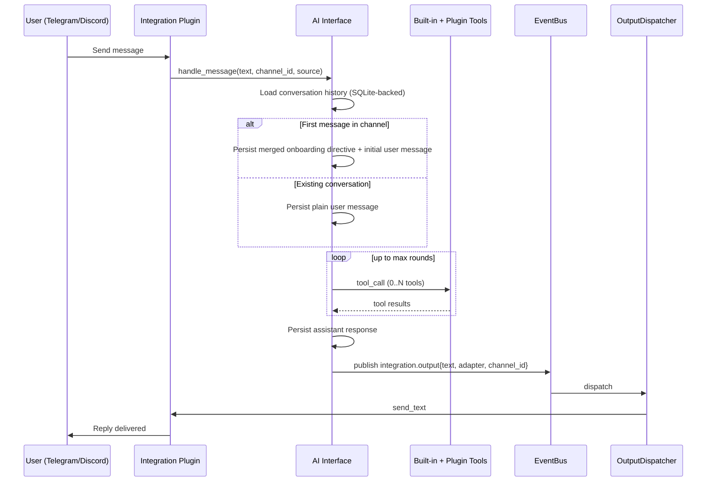

# Event Flows

This document separates:
- **Current runtime flows** (implemented and wired)
- **Target-state flows** (coming soon)

---

## Current Runtime Flow: Chat Message to Reply

Key behaviors:
- Multi-tool loops in one turn.
- Plugin tools are dynamically available (`get_tools` / `call_tool`).
- `integration.output` is adapter-agnostic and routed centrally.

---

## Current Runtime Flow: AI-Proposed Signal (`open_potential_position`)

1. AI calls `open_potential_position` with ticker/direction/catalyst/confidence/entry target/horizon.
2. Interface persists a proposed signal and publishes `signal.proposed`.
3. `RiskEngine` evaluates all registered risk rules synchronously.
4. If rejected:
   - signal persisted as `rejected`
   - tool result includes failed rule details so AI can retry with adjusted parameters.
5. If approved:
   - AI portfolio position is opened
   - signal persisted as `approved`
   - `signal.approved` published.
6. `SignalDeliveryService` broadcasts the signal via all configured output adapters.
7. If any adapter succeeds:
   - signal persisted as `delivered`
   - confirmation status set to `pending`
   - confirmation due timestamp set from `position_tracking.confirmation_timeout`
   - `signal.delivered` published.
8. If all adapters fail:
   - signal remains `approved`
   - delivery errors are persisted
   - `alert.triggered` published.

---

## Current Runtime Flow: Signal Confirmation (`confirm_signal` / `skip_signal`)

1. AI references signal IDs from `get_signals` context and calls `confirm_signal` or `skip_signal`.
2. Interface validates:
   - signal exists
   - signal is `delivered`
   - signal confirmation is `pending`
   - for confirm: `entry_price > 0` and `quantity > 0`.
3. On confirm:
   - human portfolio position is recorded with `signal_id`
   - signal confirmation status becomes `confirmed`.
4. On skip:
   - skipped human position is recorded with `signal_id`
   - signal confirmation status becomes `skipped`.
5. Pending confirmations past due receive one reminder message and remain pending.

---

## Current Runtime Flow: Create Scheduled AI Task (`ai.run_prompt`)

1. User asks to schedule recurring monitoring.
2. AI uses `list_task_handlers` and `create_task`.
3. `create_task` defaults:
   - `params.channel_id` = originating conversation channel
   - `params.adapter` = originating adapter when available
4. Scheduler fires task on cron.
5. Handler `ai.run_prompt` runs same central AI stack.
6. Scheduled run injects: `system prompt -> last 10 channel messages -> task prompt`.
7. Result is published to `integration.output` and delivered back to same channel.
   If the AI returns exactly `[NO_REPLY]`, delivery is skipped for that run.

---

## Current Runtime Flow: Stop Task by Name

1. User says “stop/remove/delete task X”.
2. AI can call `delete_task_by_name` directly.
3. If one match: task deleted in same turn.
4. If multiple matches: AI asks for narrower name.

---

## Current Runtime Flow: News/Web Tooling

### News
- Tool: `get_news(topic?, limit?, as_of?)`
- Handler: `news.briefing` for scheduled briefings
- Output path: handler -> `integration.output` -> dispatcher -> adapter

### Web Search
- Tool: `web_search(query, limit?, as_of?)`
- Backend: Serper API (`SERPER_API_KEY`)
- Handler `web.search` exists mainly to host tool metadata; scheduled `run()` is `no_action`.

---

## Current Runtime Flow: `notifications.send`

1. Scheduler fires task with handler `notifications.send`.
2. Handler validates `params.message`.
3. Publishes `integration.output` with optional `adapter`/`channel_id`.
4. Dispatcher routes to output integration(s).

---

## Target-State / Coming Soon Flows

The following are documented architecture goals but are **not fully wired as the default live runtime path**:

- Live input -> orchestrator agent chain -> autonomous signal proposal without explicit tool invocation.
- Email/webhook/custom scraper as first-class live integrations.
- Automatic recurring learning/comparison task creation from config on startup.
- `run_analysis` event path consumed by an active orchestrator subscriber in production runtime.

Keep these flows in design docs as target state, not current behavior.
