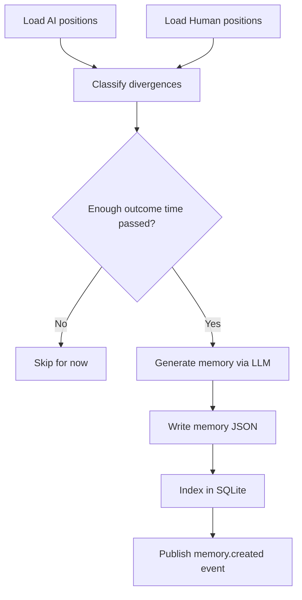

# Dual Portfolio and Learning Loop

This doc describes what is implemented today and what is still target-state.

---

## Status Snapshot

### Implemented now

- Dual portfolio files:
  - `positions/ai/*.json`
  - `positions/human/*.json`
- Signal confirmation lifecycle:
  - `confirm_signal(signal_id, entry_price, quantity)`
  - `skip_signal(signal_id, reason?)`
  - one-time pending reminder after `position_tracking.confirmation_timeout`
- Comparison task handler: `comparison.weekly`
- Memory generation model + storage:
  - JSON files in `memories/`
  - SQLite index in `memory_index`
- Memory lookup API/tooling (`get_memories`, `Store.search_memories`)

### Not fully wired / coming soon

- Automatic scheduling from `learning.comparison_schedule`
- Automatic assumed-execution timeout flow (timeout currently reminders-only, remains pending)
- Broker sync path for human portfolio
- Full live orchestrator context-pack loop that routinely feeds memories into every production decision

---

## Portfolio Model

### AI Portfolio (paper)

- Stored in `~/.clawquant/positions/ai/`
- Intended to represent system-side execution tracking
- In the default chat-first runtime, this portfolio is updated when AI uses `open_potential_position` and signals pass risk approval

### Human Portfolio (actual)

- Stored in `~/.clawquant/positions/human/`
- Updated directly by AI tools such as:
  - `confirm_signal`
  - `skip_signal`
  - `close_position`
  - `user_initiated_trade`

---

## Why Keep Two Portfolios

- Compare system recommendations versus actual user behavior.
- Quantify divergence outcomes over time.
- Turn disagreements into explicit lessons (`Memory` objects).

---

## Divergence Detection (Current Handler Logic)

`plugins/task_handlers/comparison.py` currently classifies and handles:

- `human_skipped`
- `human_initiated`
- `timing_divergence` (specific conditions)

Note:
- The `Memory` model supports `human_modified`, but current classifier logic does not yet produce that type.

---

## Comparison Handler Flow (Implemented)



### Outcome-time gating

- Minimum age is controlled by handler config (`min_outcome_days`), loaded from `learning.min_outcome_period` in `main.py`.

### Duplicate prevention

- Handler checks existing memories for same divergence before creating new ones.

---

## Memory Persistence

### JSON source of truth

Example path: `~/.clawquant/memories/mem_<id>.json`

### SQLite index

Table: `memory_index`

Key indexed fields:
- `id`
- `created_at`
- `who_was_right`
- `tags`
- `ticker`
- `confidence_impact`
- `source`

---

## How to Run the Learning Loop Today

The runtime does **not** auto-create comparison tasks from config yet. Create one explicitly with handler `comparison.weekly`.

Example task payload concept:

```json
{
  "name": "Weekly Comparison",
  "type": "comparison",
  "handler": "comparison.weekly",
  "cron_expression": "0 9 * * 0",
  "params": {}
}
```

You can create this via:
- AI tool `create_task`
- HTTP `POST /tasks`
- direct JSON task file under `~/.clawquant/tasks/`

---

## Current Practical Limits

- No automatic “assumed” human trade creation after timeout.
- No automatic broker reconciliation path.
- Memory usage in live decisioning is strongest in orchestrator-based flows, which are currently target-state for default runtime.

---

## Target-State Direction

Planned steady-state behavior:
- Auto-install comparison tasks from config on startup.
- Full orchestrator pipeline continuously consumes relevant memories in analysis context packs.
- Expanded divergence taxonomy and richer scoring (including `human_modified` and more robust timing/size deltas).
