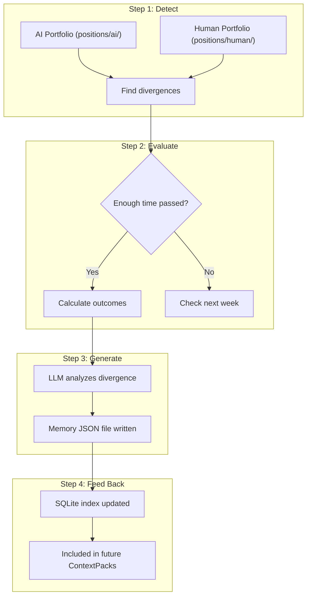

# Dual Portfolio & Learning Loop

The system maintains two parallel portfolios and learns from their divergences. The AI and human teach each other over time.

---

## The Two Portfolios

### AI Portfolio (Paper)

Every approved signal is **always** assumed executed. The AI's pure, unbiased track record.

Stored as JSON files in `~/.opensuperfin/positions/ai/`.

### Human Portfolio (Actual)

Tracks what the user **actually** did. Updated via:

| Source | Trust Level | How |
|--------|-------------|-----|
| User confirmation | High | "bought NVDA at 130" via Telegram/chat |
| User rejection | High | "skipping this one" |
| User-initiated trade | High | "bought TSLA on my own at 245" |
| Broker read-only sync | Highest | Optional integration (future) |
| Assumed execution | Low | No response after timeout (default: 4h) |

Stored as JSON files in `~/.opensuperfin/positions/human/`.

### Why Two?

1. **Clean AI benchmarking**: AI portfolio shows pure decision quality
2. **Honest human tracking**: Human portfolio shows actual results
3. **Divergence analysis**: When they differ, we measure who was right
4. **Bidirectional learning**: AI learns from human intuition, human learns from AI consistency

---

## Divergence Types

| Type | Scenario |
|------|----------|
| `human_skipped` | AI signals buy/sell, human does nothing |
| `human_modified` | AI says buy 100 units, human buys 50 |
| `human_initiated` | Human trades something AI didn't suggest |
| `timing_divergence` | Both agree on direction, different timing/price |

---

## The Learning Loop

A recurring scheduled task (weekly by default) that converts divergences into structured learnings.



### Step 1: Detect

Compare position files in `positions/ai/` vs `positions/human/`. Find cases where they differ.

### Step 2: Evaluate

Wait for the configured minimum outcome period (default: 7 days). Calculate what happened to the asset price. Compute P&L for both sides.

### Step 3: Generate

This IS an LLM task. The comparison sends divergence details to the AI:

> "You recommended BUY NVDA at $130. The human skipped, saying 'earnings will disappoint.' Two weeks later, NVDA dropped to $165 after an earnings miss. Who was right? What should we learn?"

The LLM produces a structured Memory with a lesson, tags, and confidence impact.

### Step 4: Feed Back

The Memory is:
1. Saved as a JSON file in `memories/mem_{id}.json`
2. Indexed in SQLite (tags, ticker, dates) for fast retrieval
3. Included in future ContextPacks when relevant (by ticker, sector, catalyst type, recency)

---

## Memory Storage

### JSON File (source of truth)

```json
// memories/mem_x1y2z3.json
{
  "id": "mem_x1y2z3",
  "created_at": "2026-03-01T09:00:00Z",
  "signal_id": "sig_a1b2c3",
  "divergence_type": "human_skipped",
  "ai_action": "BUY AAPL at 180",
  "human_action": "Skipped -- thinks earnings will disappoint",
  "outcome_period": "3 weeks",
  "outcome": "AAPL dropped to 165 (-8.3%)",
  "ai_pnl": -15.0,
  "human_pnl": 0.0,
  "who_was_right": "human",
  "lesson": "Human showed accurate intuition about AAPL pre-earnings risk...",
  "tags": ["earnings", "pre_earnings_caution", "AAPL", "tech"],
  "confidence_impact": -0.1,
  "referenced_in_decisions": 0
}
```

### SQLite Index (for fast queries)

```sql
CREATE TABLE memory_index (
    id TEXT PRIMARY KEY,
    created_at TEXT,
    who_was_right TEXT,
    tags TEXT,
    ticker TEXT,
    confidence_impact REAL
);
```

The index enables queries like "find memories about AAPL with tag 'earnings' from the last 90 days" without scanning every JSON file.

---

## Memory Examples

### Human was right about earnings caution

```
Signal: BUY AAPL at $180 (confidence 0.72)
Human: "Skipped -- thinks earnings will disappoint"
Result: AAPL dropped to $165 (-8.3%). Human was right.
Lesson: Pre-earnings signals for AAPL need higher confidence.
         Consider requiring >0.80 for signals within 3 weeks of earnings.
Tags: [earnings, pre_earnings_caution, AAPL, tech]
```

### AI was right about macro call

```
Signal: BUY TLT at $92 (confidence 0.75)
Human: "Skipped -- rates will stay higher for longer"
Result: TLT rose to $98 (+6.5%) as Fed signaled cuts. AI was right.
Lesson: AI's macro strategist correctly identified Fed rhetoric shift.
         Human should trust AI macro calls more when rates agent concurs.
Tags: [rates, fed, macro, TLT, bonds]
```

### Human found a blind spot

```
AI: No signal (PLTR not in watchlist)
Human: "Bought PLTR at $22 based on defense contract news"
Result: PLTR rose to $38 (+72%). Human was right.
Lesson: AI's watchlist was too narrow. Consider adding defense/AI tickers
         and a defense contract scraper integration.
Tags: [defense, AI_convergence, PLTR, blind_spot, watchlist_gap]
```

---

## How Memories Affect Future Decisions

When the orchestrator builds a ContextPack for an AAPL analysis, it queries SQLite for relevant memories:

```
Relevant Memories:
1. [2 months ago] Human skipped BUY AAPL at $180 before earnings.
   AAPL dropped 8.3%. Human was right. Pre-earnings signals need
   higher confidence.

2. [5 months ago] AI recommended BUY AAPL at $165 post-earnings dip.
   Both agreed. AAPL rose 12%. Post-earnings dips are good entries.
```

The AI sees these and adjusts: "Given pre-earnings caution has been validated for AAPL, and my confidence is only 0.68, I should either find stronger evidence or wait until after earnings."

---

## Configuration

```yaml
learning:
  comparison_schedule: "0 9 * * 0"    # Sunday 9am
  min_outcome_period: 7d              # wait before judging
  max_memories_in_context: 10         # per context pack
  memory_relevance_window: 90d        # recency filter

position_tracking:
  confirmation_timeout: 4h            # assume followed after 4h
  allow_user_initiated: true          # users can report non-AI trades
```

---

## Simulator Integration

The simulator can pre-generate memories:
1. Run simulation on historical data
2. Compare simulated signals against actual market outcomes
3. Generate memories tagged with `source: "simulation"`
4. Optionally import into production memory bank

The live system starts with learned experience rather than a blank slate.
