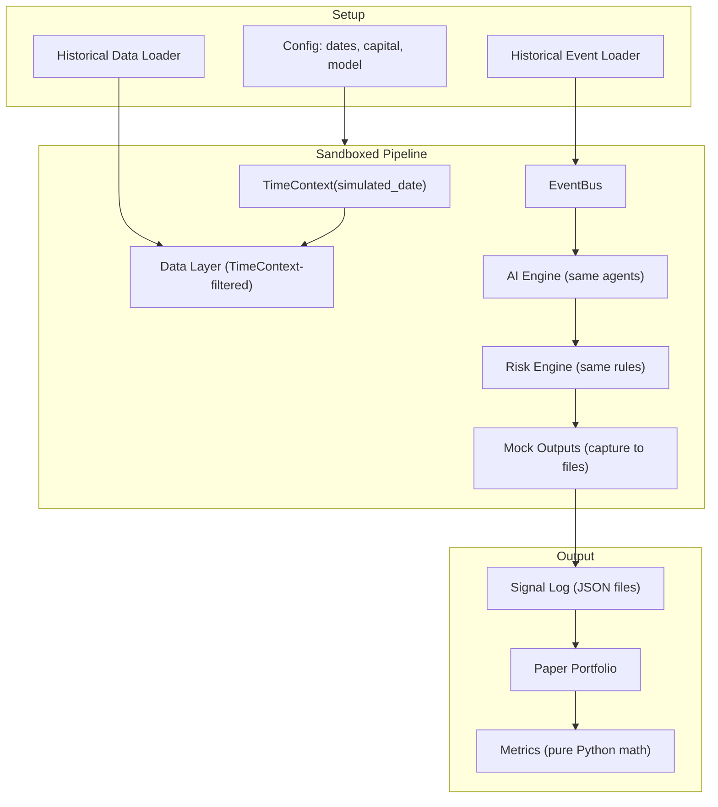

# Simulator

The simulator runs the **same pipeline** in sandbox mode with historical data and strict date filtering. It is not a separate backtesting engine -- it reuses the same AI agents, risk rules, and event processing. The only differences:

1. Data queries are filtered to the simulated date (no lookahead)
2. Integrations are mocked (outputs captured to files, not sent)
3. Events come from historical replay instead of live sources

---

## Core Concept: TimeContext

The key to zero lookahead bias. `TimeContext` is a context object that **every data query** respects.

| Mode | `current_time` | What the AI sees |
|------|----------------|------------------|
| Production | Real now | All available data |
| Simulation | Historical date | Only data with `available_at <= simulated_date` |

The data layer enforces this transparently. No component needs to know whether it's in production or simulation mode.

### The `available_at` Field

Every market data record in SQLite has two timestamps:

- `timestamp`: When the market event occurred
- `available_at`: When the system would have realistically known about it

Examples:
- Daily price close: `available_at` = market/session close time
- CPI release: `available_at` = 8:30 AM ET on release day
- Earnings: `available_at` = after-hours release time

In simulation, queries filter by `available_at`, not `timestamp`. This prevents using data before it existed.

---

## Architecture



---

## How a Simulation Run Works

### 1. Configure

```yaml
name: "claude_macro_2024"
date_range: [2024-01-01, 2024-12-31]
initial_capital: 100000
ai_provider: anthropic
ai_model: your-preferred-model        # whatever Claude/GPT/Gemini model
agents: [macro, rates, company]
slippage_bps: 10
commission_per_trade: 1.00
```

### 2. Load Historical Data

Pull historical market data into SQLite with `available_at` timestamps. Historical events (CPI releases, FOMC decisions, earnings) loaded as an event timeline.

### 3. Replay

```python
for event in chronological_events:
    time_context.advance_to(event.available_at)
    event_bus.publish(event)
    await pipeline_completes()
    # Signals captured, paper portfolio updated
```

Between events, the simulator fires daily "end of day" ticks to simulate the cron runner.

### 4. Measure

Calculate performance metrics from the paper portfolio using pure Python math:

**Returns**: Total return, CAGR
**Risk**: Sharpe ratio, max drawdown, volatility
**Quality**: Hit rate, win/loss ratio, profit factor
**Benchmarks**: vs SPY, vs QQQ over same period

### 5. Output

Results saved to `~/.opensuperfin/simulations/{name}/`:
```
simulations/
    claude_macro_2024/
        results.json           # PerformanceMetrics
        config.json            # SimulationConfig
        signals/               # all signals generated
            sig_001.json
            sig_002.json
        memos/                 # all memos generated
            ...
```

---

## Model Benchmarking

Run the same simulation with different LLM configurations:

```yaml
benchmarks:
  - name: "claude_run"
    ai_provider: anthropic
    ai_model: your-claude-model

  - name: "gpt_run"
    ai_provider: openai
    ai_model: your-gpt-model

  - name: "cheap_run"
    ai_provider: openai
    ai_model: your-cheap-model
```

Output comparison:

```
┌───────────────────┬────────┬────────┬─────────┬──────────┐
│ Run               │ Sharpe │ CAGR   │ Max DD  │ Hit Rate │
├───────────────────┼────────┼────────┼─────────┼──────────┤
│ claude_run        │  1.42  │ 18.3%  │  -8.2%  │   62%    │
│ gpt_run           │  1.15  │ 14.1%  │ -11.5%  │   58%    │
│ cheap_run         │  0.89  │ 10.2%  │ -14.3%  │   54%    │
├───────────────────┼────────┼────────┼─────────┼──────────┤
│ SPY (benchmark)   │  0.95  │ 26.3%  │  -5.5%  │   --     │
└───────────────────┴────────┴────────┴─────────┴──────────┘
```

---

## Validation Modes

### Walk-Forward

Split history into train/test windows. Train window accumulates memories; test window uses them. Validates that learning actually improves performance.

### Regime-Split

Separate results by market regime (bull, bear, volatile, crisis). Answers: does the AI make money in easy markets and lose it in hard ones?

### Survivorship-Safe

Use the asset universe that existed at the time, not today's. Prevents testing on assets that only survived because they succeeded (survivorship bias).

---

## Mock Integrations

In simulation mode:

| Integration | Simulation Behavior |
|-------------|---------------------|
| Telegram | Captures messages to signal log files |
| Email | Captures to signal log files |
| Yahoo Finance | Replaced by historical data in SQLite |
| Scrapers | Replaced by historical event replay |

Mock outputs implement the same `OutputAdapter` protocol. No component knows the difference.

---

## Simulator + Learning Loop

After a simulation, results can generate memories:
- Analyze simulated signal outcomes
- Tag as `source: "simulation"`
- Optionally import into production memory bank

This **pre-trains the memory bank** before going live. The system starts with learned experience from historical data.

---

## Cost Tracking

Token usage is tracked per simulation:
- Total tokens used
- Cost per signal
- Cost-effectiveness comparison across models

Informs decisions like: "The cheaper model costs 1/10th but Sharpe only drops 0.3 -- use it for daily monitoring."
